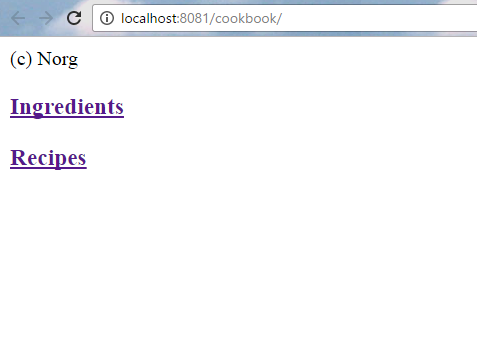
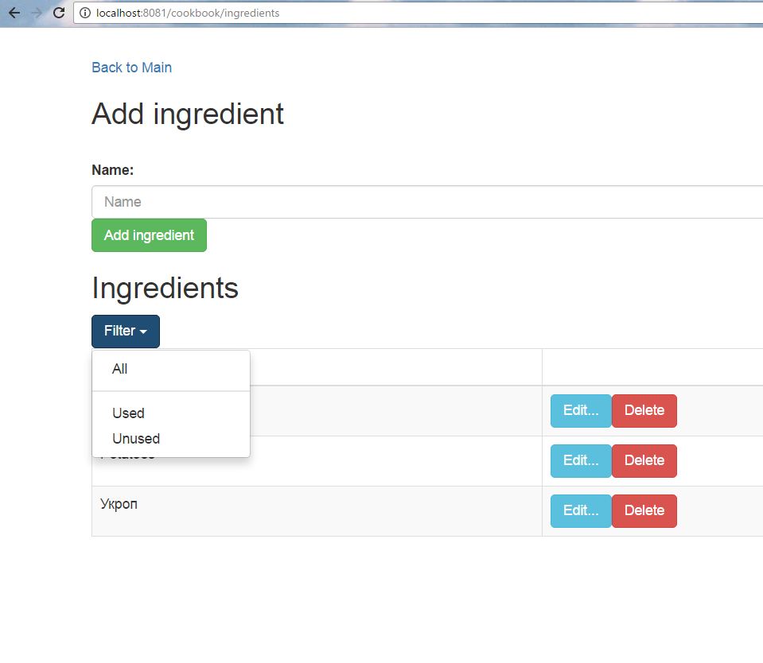
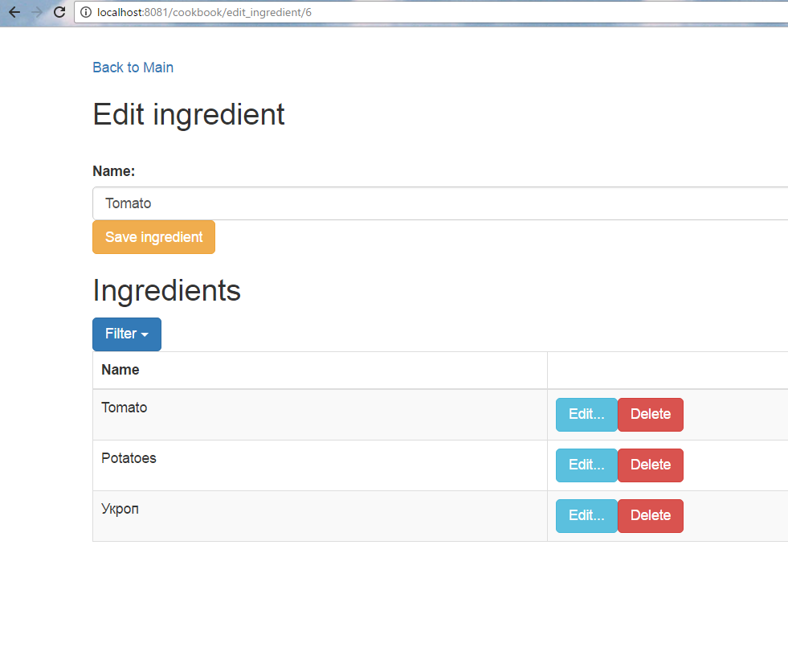
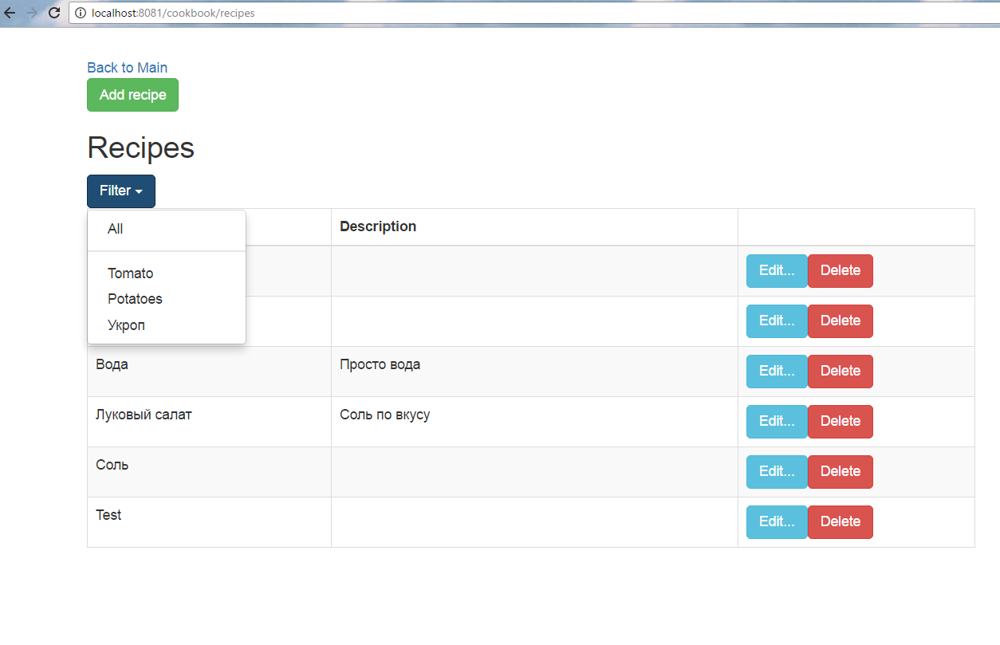
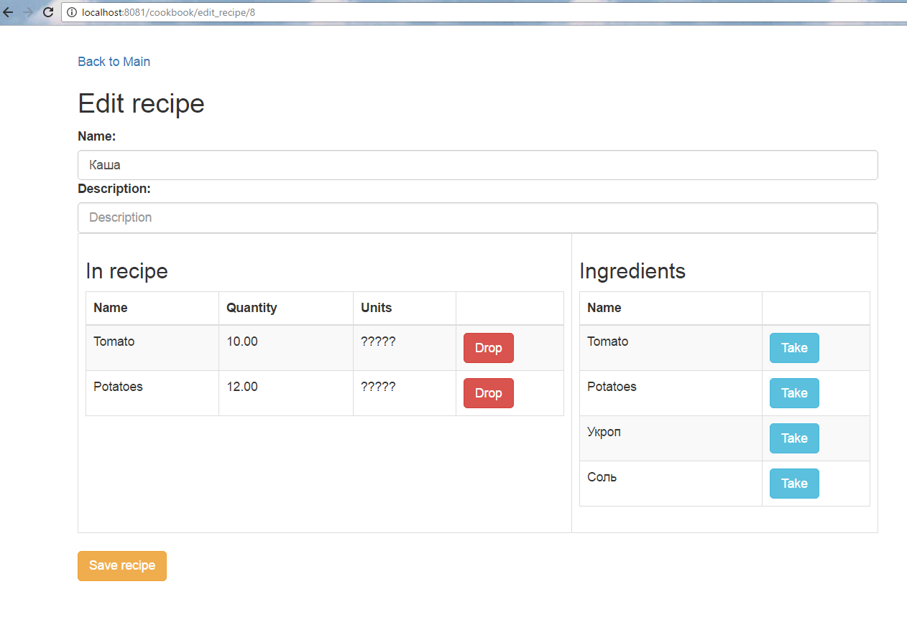

## Учебный проект "Cook Book"
Spring Web MVC + Hibernate + MySQL
===========================
Не весь функционал работает, но для демонстрации достаточно.
### Особенности реализации:
Структура базы создается `Hibernate`ом (не-продакшн решение).  
Нет разделения сущностей на `Entity` и `Model`, нет `DTO`, поскольку проект небольшой, и это не является необходимостью в данном случае.  
Вместо `DAO` использован интерфейс `CrudRepository<T, ID>`, что избавило от необходимости писать свою имплементацию.  
Реализован один контроллер, содержащий все `RequestMapper`ы.  
Веб-морда использует `Bootstrap` (чуть-чуть).
  
  
  
  
  